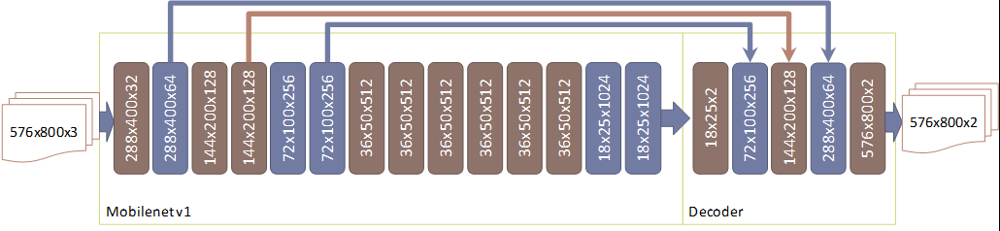
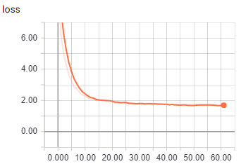

# **Udacity Lyft Challenge**

## **Goal**

Create a model that can do pixel-wise identification of objects in camera images from an urban driving simulation ( [CARLA](http://carla.org/)).

Specifically, semantic segmentation of vehicles and drivable road surface.

| Original Image | Segmented |
|---|---|
|  |  |
|  |  |
|  |  |

[Click here for a video of segmentation result](https://youtu.be/HbSoBchPZBc)

## **Data**

Udacity provided a set of 1000 camera images taken from Carla&#39;s dash of the simulated world under various weather conditions. They seem to have been captured while driving around the simulated world. Each RGB frame is encoded as a PNG file and has an accompanying semantic segmentation frame where areas are labelled. The label frames are also encoded as a PNGs. Each RGB frame and corresponding label frame are 800(w) x 600(h) pixels.

### **Carla scripting**

Since 1000 images isn&#39;t sufficient to attain high accuracies (even if augmented), I decided to synthesize my own data using the Carla simulator, which has the ability to generate a semantic segmentation image from the scene it renders.

I set the camera position and orientation such that the images and labels I produced are similar to Udacity&#39;s dataset. I increased the number of cars and pedestrians in the simulated world to reduce frames with no vehicles in the scene.

I let the program run overnight and produced a huge dataset (246,350 samples) that I could use for training.

### **Carla&#39;s hood**

The semantic segmentation data that I generated labeled Carla&#39;s own hood as a vehicle - though technically correct, it didn&#39;t match Udacity&#39;s dataset (which had the hood area labeled as nothing (0)) and caused my model&#39;s predictions to be way off. Therefore I had to write a poly-fill function to take out Carla&#39;s hood in each label frame.

### **Analyzing data**

To select the best images for training, I wrote a script to count the number of pixels in image that belong to cars or roads. The following histogram shows that about 50% of the image do not contain any car or the cars are too small (far away).

To improve accuracy in recognizing cars, I selected images with at least 75,000 pixels of vehicle in them. This reduced the data set to 83,130 images.

| | Log scale |
|---|---|
|  |  |

### **Selecting training, validation and test sets**

I decided to use the dataset synthesized from Carla (83k) as the training set, and Udacity&#39;s 1k image set as my validation set.

Then I could use Udacity&#39;s tester and grader programs as my test sets. This way, I could ensure the model was generalizing well enough on data it had not come across earlier.

## **Tech. Stack**

**Keras** : I opted to use Keras (with Tensorflow backend) for the training part of the project as it provides high level APIs for testing different ideas and pre-trained models that I could use for transfer learning.

**Jupyter** : I used a Jupyter notebook for training as it gives me the convenience of consolidating code and my notes in a single document and I can access remotely.

The environment I used for training had a GeForce GTX 1080 graphics card and was running Ubuntu 17.10, CUDA 9.1, Tensorflow 1.8, Keras 2.1.6 and Tensorboard 1.8.

**Tensorboard** : Used Tensorboard to observe the training process - especially the several metrics that measured progress, letting me optimize hyper-parameters as necessary.

Since speed is important in the prediction stage, I wanted to be able to run the model on Tensorflow using python APIs, without Keras in the mix. In addition, Udacity&#39;s workspace, the environment where the prediction phase was to be run for benchmarking, was running an older version (1.3) of Tensorflow.

I wrote a script to convert trained models exported as .hdf5 files from Keras into TensorFlow&#39;s protobuf format (.pb).

## **Model Selection**

### **VGG16**

VGG16 was the first model I used as I was getting a grip on the data and setting up the training-conversion-prediction system. It was an obvious first choice as it is a relatively simple model, with available pre-trained weights and my familiarity with it having used it on several earlier projects. But VGG was going to be slow as the model is very large, requiring large number of computations. But early in the game, I wanted to focus on accuracy more than speed.

I achieved fairly good accuracy (got me to #4 on the leaderboard), but at a leisurely 4 fps.

### **Resnet50**

In an effort to push accuracy higher, I tested the resnet50 model, also with pre-trained weights. Though accuracy was high, it quickly became clear that it was not going to get me to the 10-fps level to avoid penalties.

### [**Mobilenet**](https://arxiv.org/abs/1704.04861)

I had first worked with the Mobilenet architecture when using SSDs from Google&#39;s Tensorflow/object-detection library to detect multiple object on a video feed. I knew Mobilenet was computationally small, making it very fast but it is surprisingly accurate too, comparable to Inception-v3and VGG. The size of a trained model on disk was only 17.7Mb. In addition, Mobilenet offers a hyperparameter that one can tweak to tradeoff accuracy for speed.

This became the model I selected for the final submission.

### **Mobilenet v2**

Mobilenet v2 was introduced recently, but contrary to what I read in the paper, I found that it wasn&#39;t any more accurate than v1 and was slower too !

## **Architecture**

Mobilenet consists of 13 blocks, each of which is a stack of the following operations. Some of depth-wise convolutions have a stride of 2, cutting the input dimensions in half.

To the Mobilenet architecture, I added a decoder section with 3 deconvolution (up-sampling) layers. The deconvolution layers had strides selected such that the output dimension matches those of the layers in the Mobilenet network.

This allows adding skip connections, where outputs from inside the network are added to the outputs of the deconvolution layers. Skip connections improves segmentation precision significantly.

Decoder part of the network as designed as:

1. Conv2D: 1x1xNumClasses 2D Convolution that produces two 18x25 frames (without this shallow layer, the number of weights in the next layer would be huge)
2. Conv2DTranspose: kernel: 8x8, strides: 4x4, filters: 256, input dimension: 18x25x1024, output dimension: 72x100x256
3. Add: output of 6th block from Mobilenet: output dimension: 72x100x256
4. Conv2DTranspose: kernel: 4x4, strides: 2x2, filters: 256, input dimension: 72x100x256, output dimension: 144x200x128
5. Add: output of 4th block from Mobilenet: output dimension: 144x200x128
6. Conv2DTranspose: kernel: 4x4, strides: 2x2, filters: 256, input dimension: 144x200x128, output dimension: 288x400x64
7. Add: output of 2nd block from Mobilenet: output dimension: 288x400x64
8. Conv2DTranspose: kernel: 4x4, strides: 2x2, filters: 256, input dimension: 288x400x64, output dimension: 576x800x2
9. Sigmoid activation maps outputs to [0,1]

The output is the same size as the input and has two layers, one for each segmentation class.

### **Two decoder approach**

I also tried another model with a different decoder for each class.

This structure required more computation, but did not yield significant accuracy improvements.

### **Input images**

Training images are 800(w) x 600(h). Since the image is being up-sampled 16 fold, the math gets simpler if the image dimensions are multiples of 16. Since the bottom part of each frame is simply Carla&#39;s hood, it was convenient to simply crop the height at the bottom to 576, making  the input to the network 576x800x3.

The pixel values are mapped to floating point values in the range [-1.0, 1.0] during the pre-processing step.

## **Loss Functions**

I experimented with several loss functions in an effort to maximize the F-score by achieving balanced precision and recall values.

### [**Dice coefficient**](https://en.wikipedia.org/wiki/S%C3%B8rensen%E2%80%93Dice_coefficient) **as loss function**

Dice coefficient is a measure of similarity that I have used in earlier projects. Dice coefficient produces a value between 0 and 1. 
It is similar to IOU or Jaccard index but differs slightly in that it the denominator is simply the sum of active pixels.

d=2.|X∩Y| / (|X|+|Y|)

For each batch, intersection is calculated as:

- Intersection = sum ( y\_pred \* y\_true )

- Dice = (2 \* Intersection + 1.0) / (sum(y\_pred) + sum(y\_true) + 1.0)

The addition of 1.0 is to prevent NaNs when denominator could otherwise be 0.

To force the network to pay more attention to cars, I developed a weighted loss function from the dice coefficient:

- Loss = 3.0 - { 2 \* dice(car\_pred, car\_truth) +  dice(road\_layer, road\_truth) }

While training with dice coefficient, I measured other metrics: false positives, false negatives, precision and recall for each of the two classes.

It became clear that for cars, the network tended to have low precision values, which was affecting the overall F-score.

The best F-score I achieved with this loss function was **0.875**.

### **False Positives and Negatives as loss function**

Another approach I tried was to simply minimize both false positives and false negatives. This allowed me to weight the false positives for cars, in an effort to increase precision.

- Loss = 2 \* { 1.5 \* FN(car\_pred, car\_truth) + FP(car\_pred, car\_truth) } + { FN(road\_pred, road\_truth) + 2.0 \* FP(road\_pred, road\_truth) }

This loss function worked well but because of too many hyper-parameters, it was hard to train it right, requiring several trial and error attempts, tweaking the weights ever so slightly. The best accuracy F score I achieved with this loss function was **0.908** , which put me in the top 10 of the leaderboard.

### **F-score as loss function**

Finally, I developed a loss function around the F-score calculation, this eliminated hyper-parameter tuning and was in-line with Udacity&#39;s ranking metrics defined as:

Fb = ( 1 + b^2) \* (precision  \* recall) / b^2 \* (precision + recall)

For the challenge, b was set to 2 for vehicles and 0.5 for the road surface. The loss function I developed around this was:

- Loss = 30.0 \* ( 1 - CarF(car\_pred, car\_truth) ) + 10.0 \* ( 1 - RoadF(road\_pred, road\_truth) )

This function emphasizes vehicle F scores over road by a factor of 3. The best F score from using this loss function was **0.918** which put me in the top 5 of the leaderboard.

## **Training**

Training images and labels are stored as PNG files in separate folders. Glob was used to list all the files and the list was wrapped in a subclass of keras::Sequence - which is like a generator, but offers custom pre-processing and can be used with Keras&#39; model::fit\_generator method. Another advantage of using a Keras::Sequence is the ability to leverage multiprocessing. I found that 3 workers threads was optimal.

Similarly, validation data was also supplied to fit\_generator as a sub-class of Sequence.

### **Choice of optimizer and parameters**

Adam optimizer is probably the most popular adaptive optimizer and I have had success using it and found that it converges quicker. But after reading papers comparing Stochastic Gradient Descent (SGD) with Adaptive optimizers like Adam, I decided to use SGD as its better generalization would make the model perform better on the Udacity test data.

- [The Marginal Value of Adaptive Gradient Methods in Machine Learning](https://arxiv.org/pdf/1705.08292.pdf)
- [Improving Generalization Performance by Switching from Adam to SGD](https://arxiv.org/pdf/1712.07628.pdf)

I started with a learning rate of 1e-3 and decayed it by 0.3 on loss stagnation using keras::ReduceLROnPlateau.

### **Choice of batch size, number of epochs**

Since the data was sufficiently large, looping on the dataset 2 or 3 times was sufficient for the model to converge. Since the size of the inputs was large at 576x800, I could not use large batch sizes during training. When I was training the entire network, I was limited to 5 images per batch. When fine-tuning the network by freezing the bottom layers, I could use larger batch sizes of up to 30 images. Given a GPU with larger memory, I could have increased it even further.

### **Tracking progress**

The following metrics were tracked during training for both training and validation sets:

- Car-precision
- Car-recall
- Road-precision
- Road-recall
- F-score
- Car-Dice-Coefficient
- Road-Dice-Coefficient

Training and validation loss curves were watched closely to ensure the model is not overfitting the training set.

Keras callback TensorBoard was used to write TensorBoard events to disk. These allowed the metrics to be visualized:
 
|  |  |
|---|---|
|  |  |
|  |  |
|  |  |
|  |  |
|  | |

### **Checkpoints &amp; Logs**

Keras callback  ModelCheckpoint was used to checkpoint weights along each epoch.

At the end of training, I would test the model on Udacity&#39;s workspace and log the outcome in a table. This allowed me to study the effects of changes to hyper-parameters closely. Here is a section of the log file:

## **Prediction**

For efficient prediction, the key is to minimize numpy operations outside the TensorFlow graph - it is possible to do most transformations within the graph itself, maximizing GPU acceleration.

After the Keras model was exported to .pb protobuf and loaded in to a TensorFlow graph, I accessed the input placeholder and output tensor by supplying the layer names to the tf.import\_graph\_def function. To these tensors, I attached pre- and post-processing operations as follows:

### **Optimization**

The first step in optimization is to profile runtime of operations, which I did with timestamps. Unsurprisingly, TensorFlow session&#39;s run command that took the lion&#39;s share of execution time. So I focused my effort on optimizing run time of session::run and ignored run times of MP4 decoder and base64 encoder.

The simplest optimization for prediction is to batch the data, maximizing GPU usage. I was able hit the target of 10fps simply by batching 30 frames per prediction.

## Files and Commands to run

| File | Purpose | 
|---|---|
| weights.pb | trained model weights & biases |
| predict.py | load model and run predictions |
| train-mobilenet.ipynb | Jupyter notebook for training model |
| keras2tf.py | Convert hdf5 to TensorFlow Protobuf |
| writeup folder | Contains images used in this writeup |
| README.md | this |

### Commands

- ./preinstall_script.sh
- tester 'python predict.py weights.pb'
- grader 'python predict.py weights.pb'
